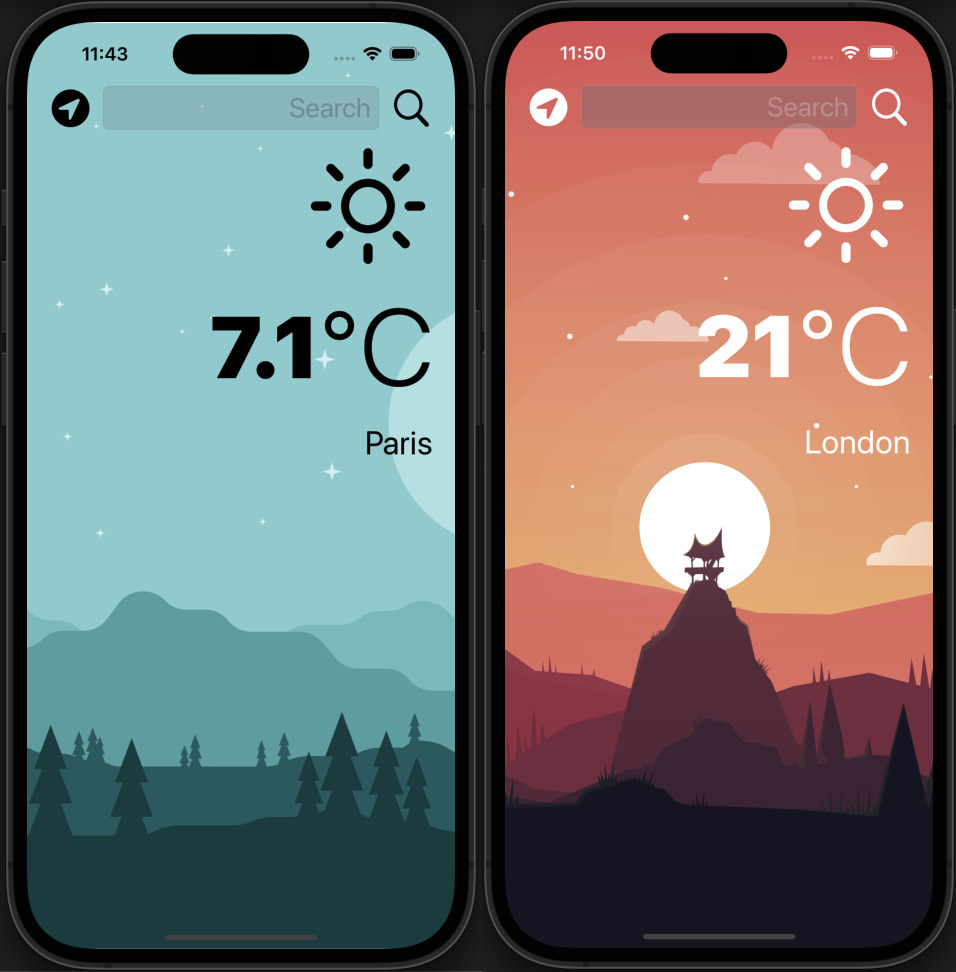

# Clima
## Project summary
A beautiful, dark-mode enabled weather app. Users will be able to check the weather for the current location based on the GPS data from the iPhone, as well as by searching for a city manually.

## Technical Points
- Create a dark-mode enabled app.
- Use vector images as image assets.
- Use the UITextField to get user input.
- The delegate pattern.
- Swift protocols and extensions.
- Swift guard keyword.
- Swift computed properties.
- Swift closures and completion handlers.
- Use URLSession to network and make HTTP requests.
- Parse JSON with the native Encodable and Decodable protocols.
- Use Grand Central Dispatch to fetch the main thread.
- Use Core Location to get the current location from the phone GPS.

